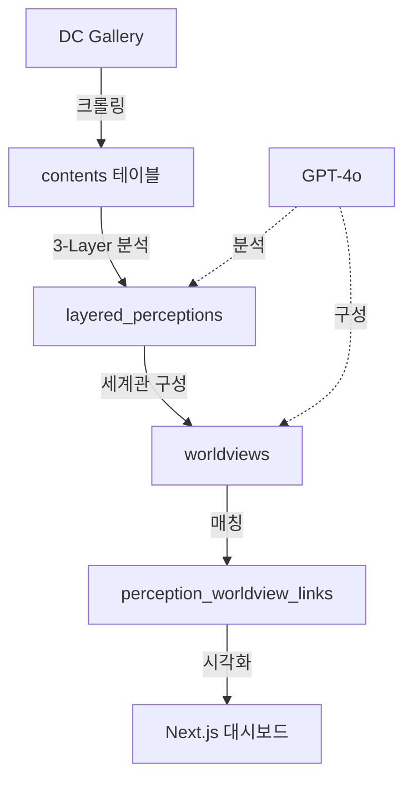

# DC Gallery 세계관 분석 시스템

> DC Inside 정치 커뮤니티 담론의 **세계관 구조**를 자동으로 분석하여, 일반인(특히 더불어민주당 지지자)이 상대방의 사고 체계를 이해할 수 있도록 돕는 AI 모니터링 시스템

[](https://opensource.org/licenses/MIT)
[](https://www.python.org/downloads/)
[](https://nextjs.org/)

## 📋 목차

- [프로젝트 개요](#-프로젝트-개요)
- [핵심 개념](#-핵심-개념)
- [시스템 아키텍처](#-시스템-아키텍처)
- [빠른 시작](#-빠른-시작)
- [주요 기능](#-주요-기능)
- [데이터 파이프라인](#-데이터-파이프라인)
- [세계관 구조](#-세계관-구조)
- [대시보드](#-대시보드)
- [개발 가이드](#-개발-가이드)

---

## 🎯 프로젝트 개요

### 누구를 위한 프로젝트인가?

**일반인, 특히 더불어민주당 지지자**를 위한 도구입니다.
- DC Inside 정치 커뮤니티의 담론이 "왜 저렇게 생각하는지" 이해하고 싶은 분
- 온/오프라인에서 상대방과 대화할 때 맥락을 파악하고 싶은 분
- 정치 담론의 심층 구조를 학습하고 싶은 분

### 해결하려는 문제

DC Inside의 정치 담론은 단순한 "의견"이 아닌 **체계적인 세계관**에 기반합니다. 이 세계관을 이해하지 못하면:
- 표면적 주장만 반박해도 효과가 없음
- 심층 믿음(deep beliefs)은 그대로 남음
- 대화가 평행선을 그음

### 우리의 접근

**자동 모니터링 + 3-Layer 분석**을 통해 담론의 심층 구조를 파악하고, **계층형 세계관**으로 조직화하여 실시간으로 제시합니다.

```
표면층 (Explicit Claims)
  ↓
암묵층 (Implicit Assumptions)
  ↓
심층 (Deep Beliefs) ← 세계관의 핵심
```

### 핵심 가치

1. **맥락 이해**: 왜 그렇게 생각하는지 구조적으로 이해
2. **효과적 대화**: 심층 믿음을 인지한 대응 가능
3. **데이터 기반**: GPT-4o를 활용한 대규모 분석

---

## 💡 핵심 개념

### 세계관 (Worldview)이란?

특정 집단이 공유하는 **해석 프레임워크**:

```python
{
  "category": "민주당/좌파에 대한 인식",
  "subcategory": "독재 재현",

  "narrative": {
    "summary": "민주당은 과거 독재 정권의 방식을 재현하고 있다",

    "examples": [{
      "case": "유심교체 정보 유출",
      "dc_interpretation": "사찰을 통한 독재적 통치 시도",
      "normal_interpretation": "정보 유출 사건",
      "gap": "의도적 독재 vs 정보 문제"
    }],

    "logic_chain": "사찰 → 권력 장악 → 독재 사회"
  },

  "metadata": {
    "core": {
      "primary_subject": "민주당",
      "primary_attribute": "독재적 성향"
    },
    "slippery_slope": {
      "trigger": "사찰 사건",
      "escalation": "권력 장악 시도",
      "endpoint": "독재 사회"
    },
    "emotional_drivers": {
      "primary": "불신",
      "urgency_level": "높음"
    }
  }
}
```

### 왜 세계관인가?

| 기존 접근 | 세계관 접근 |
|----------|-----------|
| 개별 주장 반박 | 심층 믿음 이해 |
| "그건 틀렸어" | "왜 그렇게 생각하는지 이해해" |
| 효과 없음 | 효과적 대화 가능 |

---

## 🏗 시스템 아키텍처

### 전체 플로우



### 기술 스택

**백엔드**
- Python 3.11+ (asyncio)
- OpenAI GPT-5 / GPT-5-mini
- Supabase (PostgreSQL + pgvector)

**프론트엔드**
- Next.js 14 (App Router)
- TypeScript
- TailwindCSS
- SWR (data fetching)

**인프라**
- GitHub Actions (자동화)
- Vercel (대시보드 배포)

---

## 🚀 빠른 시작

### 1. 환경 설정

```bash
# 저장소 클론
git clone https://github.com/yourusername/moniterdc.git
cd moniterdc

# Python 환경
python -m venv venv
source venv/bin/activate  # Windows: venv\Scripts\activate
pip install -r requirements.txt

# 대시보드 환경
cd dashboard
npm install
```

### 2. 환경변수 설정

```bash
# .env
SUPABASE_URL=https://your-project.supabase.co
SUPABASE_SERVICE_KEY=your-service-key
SUPABASE_ANON_KEY=your-anon-key
OPENAI_API_KEY=sk-proj-...

# dashboard/.env.local
NEXT_PUBLIC_SUPABASE_URL=https://your-project.supabase.co
NEXT_PUBLIC_SUPABASE_ANON_KEY=your-anon-key
```

### 3. 데이터베이스 마이그레이션

```bash
# Supabase Dashboard에서 실행
# supabase/migrations/*.sql 파일들을 순서대로 실행
```

### 4. 실행

```bash
# 데이터 수집 및 분석
python phase1_collect_data.py      # 1. 크롤링
python phase3_layered_analysis.py  # 2. 3-Layer 분석

# 세계관 구성
python -c "
import asyncio
from engines.analyzers.optimal_worldview_constructor import OptimalWorldviewConstructor

async def main():
    constructor = OptimalWorldviewConstructor()
    await constructor.build_hierarchical_worldviews()

asyncio.run(main())
"

# 대시보드 실행
cd dashboard
npm run dev
# http://localhost:3000
```

---

## 🎨 주요 기능

### 1. 3-Layer 분석

**LayeredPerceptionExtractor**가 각 게시글을 3개 층으로 분석:

```python
{
  "explicit_claims": [
    {
      "subject": "민주당",
      "predicate": "유심교체 정보를 불법으로 얻었다",
      "quote": "유심교체를 어떻게 알아"
    }
  ],

  "implicit_assumptions": [
    "민주당은 통신사를 협박해서 정보를 얻는다",
    "이런 사찰은 독재의 시작이다"
  ],

  "deep_beliefs": [
    "민주당/좌파는 과거 독재정권처럼 사찰로 반대파를 제거한다",
    "지금의 작은 사찰이 곧 전면적 감시독재 사회로 발전한다"
  ],

  "worldview_hints": "과거 독재 → 현재 재현, 좌파 = 독재 본성"
}
```

### 2. 세계관 자동 발견

**OptimalWorldviewConstructor**가 계층형 세계관을 자동으로 발견하고 생성:

- **동적 생성**: 고정된 카테고리가 아님, 데이터에서 패턴을 발견
- **자동 업데이트**: 새로운 담론 패턴이 감지되면 세계관 추가/변경
- **계층 구조**: 대분류 → 세부 세계관으로 자동 조직화

**현재 발견된 세계관 (2025-01 기준)**
- 3개 대분류, 6개 세부 세계관
- 민주당/좌파에 대한 인식 > 독재 재현
- 외부 세력의 위협 > 중국의 부정적 영향
- (계속 추가/변경됨)

### 3. Hybrid 매칭

**Vector Embedding (70%) + Keyword (30%)**로 perception을 세계관에 자동 분류:

```python
hybrid_score = (
    0.7 * cosine_similarity(perception_embedding, worldview_embedding) +
    0.3 * keyword_match_score(perception_keywords, worldview_concepts)
)

if hybrid_score > 0.5:
    create_link(perception_id, worldview_id, hybrid_score)
```

### 4. 대시보드 시각화

- **계층형 네비게이션**: 대분류 → 세부 세계관
- **원본 글 보기**: 세계관이 발견된 실제 DC Gallery 글
- **Narrative 표시**: DC 해석 vs 일반 해석 대비
- **반박 논리** (개발 중): 각 세계관에 대한 효과적 대응

---

## 📊 데이터 파이프라인

### 자동 모니터링 (GitHub Actions)

시스템은 **자동으로** 다음을 수행합니다:
- DC Inside 미국정치 갤러리(`uspolitics`) 모니터링
- 새 게시글 수집 및 3-Layer 분석
- 세계관 자동 업데이트 및 매칭

### 수동 실행 (개발자용)

**1. 데이터 수집**
```bash
python scripts/collect_500_posts.py
```
- DC Gallery에서 개념글 수집
- `contents` 테이블에 저장

**2. 3-Layer 분석**
```python
import asyncio
from engines.analyzers.layered_perception_extractor import LayeredPerceptionExtractor

extractor = LayeredPerceptionExtractor()
# 각 content에 대해 extract_layered_perception() 실행
```
- GPT-5-mini 사용
- `layered_perceptions` 테이블에 저장
- 비용: ~$0.05/글

**3. 세계관 구성**
```python
import asyncio
from engines.analyzers.optimal_worldview_constructor import OptimalWorldviewConstructor

async def main():
    constructor = OptimalWorldviewConstructor()
    await constructor.construct_all()

asyncio.run(main())
```
- GPT-5 사용하여 세계관 자동 발견
- `worldviews` 테이블에 저장
- `perception_worldview_links` 자동 생성

**4. 지속적 업데이트**
```python
import asyncio
from engines.analyzers.worldview_updater import WorldviewUpdater

async def main():
    updater = WorldviewUpdater()
    await updater.daily_update()  # 일일 업데이트
    # await updater.weekly_update()  # 주간 예시 보강
    # await updater.check_and_rebuild_if_needed()  # 재구성 판단

asyncio.run(main())
```

---

## 🌍 세계관 구조

### 예시: "독재 재현" 세계관

**Narrative** (이야기)
```
민주당은 과거 독재 정권의 방식을 재현하고 있다.

예시: 유심교체 정보 사건
- DC Gallery 해석:
  사찰을 통한 독재적 통치를 시도하고 있다

- 일반적 해석:
  정치적 논란 속의 정보 유출 사건

- 해석 차이의 핵심:
  의도적 독재 시도 vs 정보 유출 문제

논리 연쇄: 사찰 → 권력 장악 → 독재 사회
```

**Metadata** (구조)
```json
{
  "core": {
    "primary_subject": "민주당",
    "primary_attribute": "독재적 성향",
    "primary_action": "사찰을 통한 권력 장악"
  },

  "interpretation_frame": {
    "historical_lens": {
      "reference_period": "과거 독재 시대",
      "reference_events": ["사찰 사건", "권력 집중"],
      "projection_logic": "과거 패턴 → 현재 반복"
    },

    "slippery_slope": {
      "trigger": "사찰 사건",
      "escalation": "권력 장악 시도",
      "endpoint": "독재 사회"
    }
  },

  "emotional_drivers": {
    "primary": "불신",
    "secondary": ["불안", "경계"],
    "urgency_level": "높음"
  }
}
```

**Deconstruction** (반박 논리) - 개발 중
```json
{
  "logical_flaws": [
    {
      "type": "슬리퍼리 슬로프",
      "description": "사찰 사건 → 독재 사회로의 필연적 발전 가정",
      "rebuttal": "단일 사건과 체제 변화는 다른 차원의 문제"
    }
  ],

  "fact_checks": [
    {
      "claim": "민주당이 통신사를 협박해 정보 취득",
      "reality": "정보 유출 경로는 다양하며 협박 증거 없음",
      "evidence": "[팩트체크 링크]"
    }
  ]
}
```

---

## 🖥 대시보드

### 접속

```bash
cd dashboard
npm run dev
# http://localhost:3000
```

### 화면 구성

**1. 메인 페이지** - 계층형 세계관 맵
- 3개 대분류 카테고리
- 각 카테고리별 세부 세계관
- perception 개수, 강도 표시

**2. 세계관 상세 페이지** (`/worldviews/[id]`)
- Narrative (예시 중심 설명)
- Metadata 시각화
  - Core (주체 = 속성)
  - Slippery Slope 다이어그램
  - Emotional Drivers
- **원본 글 목록** ← 실제 DC Gallery 게시글
  - 제목, 본문 미리보기
  - 원문 링크 (DC Gallery)
  - 추출된 perception 표시
- 반박 논리 (개발 중)

**3. 검색 기능** (개발 중)
- 키워드로 세계관 검색
- 관련 세계관 추천

---

## 👨‍💻 개발 가이드

### 프로젝트 구조

```
moniterdc/
├── engines/                    # 핵심 분석 엔진
│   ├── analyzers/              # ✅ NEW schema 전용
│   │   ├── layered_perception_extractor.py  # 3-Layer 분석
│   │   ├── optimal_worldview_constructor.py # 세계관 자동 발견
│   │   ├── worldview_updater.py            # 자동 업데이트
│   │   ├── belief_normalizer.py            # 신념 정규화
│   │   └── context_guide_builder.py        # 맥락 가이드
│   ├── collectors/
│   │   └── content_collector.py            # 통합 수집 엔진
│   ├── adapters/
│   │   └── dc_gallery_adapter.py           # DC Gallery 어댑터
│   └── utils/
│       ├── supabase_client.py
│       └── embedding_utils.py
│
├── dashboard/                  # Next.js 대시보드 (개편 예정)
│   ├── app/
│   │   ├── page.tsx           # 메인 페이지
│   │   ├── worldviews/[id]/page.tsx  # 세계관 상세
│   │   └── api/worldviews/    # API
│   └── components/
│
├── supabase/migrations/        # DB 스키마 (NEW schema)
│   ├── 100_create_contents.sql
│   ├── 201_create_layered_perceptions.sql
│   ├── 103_create_worldviews.sql
│   └── 203_create_perception_worldview_links.sql
│
├── scripts/                    # 실행 스크립트
│   ├── collect_500_posts.py   # 데이터 수집
│   └── complete_setup.py      # 전체 설정
│
├── _deprecated/                # 사용 안 함 (OLD schema)
│   └── engines/               # perception_extractor 등
│
└── README.md                   # 이 문서
```

### 핵심 클래스

**LayeredPerceptionExtractor**
```python
from engines.analyzers.layered_perception_extractor import LayeredPerceptionExtractor

extractor = LayeredPerceptionExtractor()
perception = await extractor.extract_layered_perception(
    content_id="...",
    title="...",
    body="..."
)
```

**OptimalWorldviewConstructor**
```python
from engines.analyzers.optimal_worldview_constructor import OptimalWorldviewConstructor

constructor = OptimalWorldviewConstructor()

# 계층형 세계관 구성
worldviews = await constructor.build_hierarchical_worldviews()

# perception 매칭
await constructor._match_perceptions_to_worldviews(perceptions, worldviews)
```

**WorldviewUpdater**
```python
from engines.analyzers.worldview_updater import WorldviewUpdater

updater = WorldviewUpdater()

# 일일 업데이트
await updater.daily_update()

# 주간 업데이트 (예시 추가)
await updater.weekly_update()

# 월간 체크 (재구성 필요 시)
await updater.check_and_rebuild_if_needed()
```

### API 엔드포인트

**GET /api/worldviews**
```typescript
// 세계관 목록 조회
const { worldviews, pagination } = await fetch('/api/worldviews?limit=50')
  .then(r => r.json())
```

**GET /api/worldviews/:id**
```typescript
// 세계관 상세 조회
const {
  ...worldview,
  perceptions,     // 연결된 perception 목록
  contents,        // 원본 글 목록
  strength_history // 강도 변화 히스토리
} = await fetch(`/api/worldviews/${id}`).then(r => r.json())
```

### 데이터베이스 스키마

**주요 테이블**

```sql
-- 원본 글
CREATE TABLE contents (
    id UUID PRIMARY KEY,
    title TEXT,
    body TEXT,
    source_url TEXT,
    gallery_id TEXT,
    published_at TIMESTAMPTZ
);

-- 3-Layer 분석 결과
CREATE TABLE layered_perceptions (
    id UUID PRIMARY KEY,
    content_id UUID REFERENCES contents(id),
    explicit_claims JSONB,
    implicit_assumptions JSONB,
    deep_beliefs JSONB,
    worldview_hints TEXT
);

-- 세계관
CREATE TABLE worldviews (
    id UUID PRIMARY KEY,
    title TEXT,
    frame JSONB,  -- { category, subcategory, narrative, metadata }
    strength_overall FLOAT,
    total_perceptions INT
);

-- perception ↔ worldview 연결
CREATE TABLE perception_worldview_links (
    id UUID PRIMARY KEY,
    perception_id UUID REFERENCES layered_perceptions(id),
    worldview_id UUID REFERENCES worldviews(id),
    relevance_score FLOAT
);
```

---

## 🔄 자동화

### GitHub Actions

**.github/workflows/daily_update.yml**
```yaml
name: Daily Worldview Update

on:
  schedule:
    - cron: '0 2 * * *'  # 매일 오전 2시 (KST 11시)
  workflow_dispatch:

jobs:
  update:
    runs-on: ubuntu-latest
    steps:
      - uses: actions/checkout@v3
      - name: Setup Python
        uses: actions/setup-python@v4
        with:
          python-version: '3.11'
      - name: Install dependencies
        run: pip install -r requirements.txt
      - name: Run daily update
        env:
          SUPABASE_URL: ${{ secrets.SUPABASE_URL }}
          SUPABASE_SERVICE_KEY: ${{ secrets.SUPABASE_SERVICE_KEY }}
          OPENAI_API_KEY: ${{ secrets.OPENAI_API_KEY }}
        run: |
          python -c "
          import asyncio
          from engines.analyzers.worldview_updater import WorldviewUpdater
          asyncio.run(WorldviewUpdater().daily_update())
          "
```

---

## 📈 성과 및 통계

### 현재 데이터

- **원본 글**: 297개
- **Perception**: 297개 (3-Layer 분석 완료)
- **세계관**: 6개 (계층형)
- **링크**: 26개 (perception-worldview)

### 세계관별 분포

| 세계관 | Perception 수 |
|--------|--------------|
| 중국의 부정적 영향 | 10개 |
| 좌파의 사회적 위협 | 7개 |
| 독재 재현 | 5개 |
| 북한의 지속적 위협 | 3개 |
| 사법부와 언론의 결탁 | 1개 |

### 비용 분석 (GPT-4o)

- 3-Layer 분석: ~$0.05/글
- 세계관 구성: ~$0.30/세계관
- 일일 업데이트: ~$0.10/일

---

## 🚧 개발 중 기능

### 1. 반박 논리 생성 (Deconstruction)

각 세계관에 대한 6가지 반박 전략:
- 논리적 결함 (Logical Flaws)
- 팩트체크 (Fact Checks)
- 대안적 해석 (Alternative Interpretations)
- 역사적 수정 (Historical Corrections)
- 감정적 이해 (Emotional Understanding)
- 대화 가이드 (Dialogue Guide)

### 2. 검색 기능

키워드로 세계관 검색 및 관련 세계관 추천

### 3. 모니터링 대시보드

- 세계관 강도 변화 추적
- 새로운 세계관 발견 알림
- 트렌드 분석

---

## 🤝 기여하기

1. Fork the repository
2. Create your feature branch (`git checkout -b feature/AmazingFeature`)
3. Commit your changes (`git commit -m 'Add some AmazingFeature'`)
4. Push to the branch (`git push origin feature/AmazingFeature`)
5. Open a Pull Request

---

## 📄 라이센스

MIT License - 자유롭게 사용, 수정, 배포 가능

---

## 📞 문의

- Issues: [GitHub Issues](https://github.com/yourusername/moniterdc/issues)
- Email: your.email@example.com

---

## 🙏 감사의 말

이 프로젝트는 다음 기술들을 사용합니다:
- OpenAI GPT-4o
- Supabase
- Next.js
- Python asyncio

---

**Built with ❤️ to bridge understanding gaps**

Last Updated: 2025-01-05
