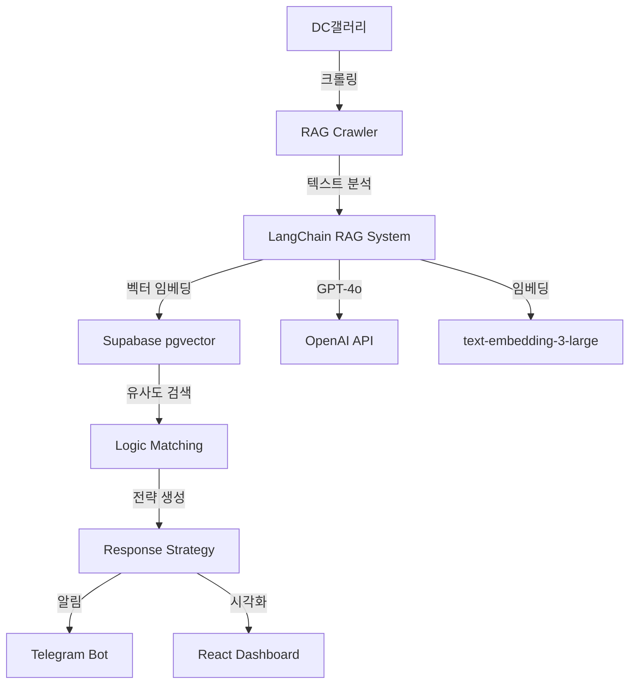

# 🤖 Logic Defense RAG System

> **정치 논리 분석 및 대응 자동화 시스템**  
> DC갤러리 정치 논리를 실시간으로 수집, 분석하고 LangChain RAG를 통해 최적의 대응 전략을 제시하는 AI 시스템

## ✨ v3.0 주요 업데이트 - LangChain/RAG 통합

### 🎯 새로운 기능
- **LangChain RAG 시스템**: 과거 논리 학습 및 컨텍스트 기반 대응
- **벡터 검색**: Supabase pgvector를 활용한 유사 논리 매칭
- **자동 매칭**: 공격 논리에 대한 방어 논리 자동 추천
- **효과성 학습**: 실제 사용 결과를 바탕으로 한 베이지안 점수 업데이트
- **트렌딩 분석**: 실시간 키워드 및 논리 패턴 분석
- **대화 히스토리**: RAG 컨텍스트 유지 및 개선

## 📋 목차

1. [시스템 개요](#시스템-개요)
2. [기술 스택](#기술-스택)
3. [설치 가이드](#설치-가이드)
4. [사용 방법](#사용-방법)
5. [LangChain/RAG 아키텍처](#langchainrag-아키텍처)
6. [API 문서](#api-문서)
7. [대시보드](#대시보드)
8. [자동화 설정](#자동화-설정)

## 🎨 시스템 개요



## 🛠 기술 스택

### 핵심 기술
- **LangChain**: RAG 파이프라인 및 체인 관리
- **Supabase**: PostgreSQL + pgvector + Realtime
- **OpenAI GPT-4o**: 논리 분석 및 전략 생성
- **Python 3.11**: 비동기 처리 (asyncio)
- **Next.js 14**: 실시간 대시보드

### 주요 라이브러리
```python
langchain>=0.1.0          # RAG 프레임워크
langchain-openai>=0.0.5   # OpenAI 통합
pgvector>=0.2.4          # 벡터 DB
supabase>=2.3.0          # 데이터베이스
```

## 📦 설치 가이드

### 1. 저장소 클론
```bash
git clone https://github.com/yourusername/moniterdc.git
cd moniterdc
```

### 2. Python 환경 설정
```bash
python -m venv venv
source venv/bin/activate  # Windows: venv\Scripts\activate
pip install -r requirements.txt
```

### 3. 환경변수 설정
```bash
cp .env.example .env
# .env 파일 편집하여 API 키 입력
```

### 4. Supabase 마이그레이션
```bash
# Supabase 대시보드에서 SQL 실행
# 1. pgvector 확장 설치
CREATE EXTENSION IF NOT EXISTS vector;

# 2. 마이그레이션 파일 실행
# supabase/migrations/010_langchain_rag_system.sql 내용 실행
```

### 5. 대시보드 설치
```bash
cd dashboard
npm install
npm run dev
```

## 🚀 사용 방법

### RAG 크롤러 실행
```bash
# 기본 실행 (크롤링 + RAG 분석 + 매칭)
python rag_crawler.py

# 특정 갤러리만 분석
python rag_crawler.py --gallery uspolitics

# 테스트 모드
python rag_crawler.py --test
```

### RAG 시스템 직접 사용
```python
from rag_system.rag_logic_system import get_rag_system

async def analyze_text():
    rag = get_rag_system()
    
    # 논리 분석
    result = await rag.analyze_logic(
        text="정부의 경제 정책이 실패했다는 증거가 명확하다.",
        metadata={'logic_type': 'attack', 'source': 'test'}
    )
    
    # 대응 논리 찾기
    counter = await rag.find_counter_logic(text)
    print(counter['answer'])
```

## 🏗 LangChain/RAG 아키텍처

### 1. 문서 처리 파이프라인
```python
텍스트 입력 → 청킹(1000자) → 임베딩 생성 → pgvector 저장
```

### 2. RAG 체인 구성
```python
History-Aware Retriever → Context 검색 → LLM 프롬프팅 → 응답 생성
```

### 3. 벡터 검색 전략
- **유사도 임계값**: 0.7 이상
- **검색 개수**: 상위 5개
- **필터링**: logic_type, classification, effectiveness_score

### 4. 효과성 학습 알고리즘
```python
# 베이지안 평균
new_score = ((base_score * 10) + (success_count * 10)) / (10 + usage_count)
```

## 📊 대시보드

### 접속 방법
```
http://localhost:3000
```

### 주요 기능
- **실시간 모니터링**: WebSocket 기반 실시간 업데이트
- **논리 분석**: 공격/방어 논리 상세 분석
- **매칭 결과**: 신뢰도 기반 매칭 시각화
- **트렌딩**: 키워드 및 논리 패턴 트렌드
- **효과성 추적**: 사용 통계 및 성공률

## ⚙️ 자동화 설정

### GitHub Actions
```yaml
# .github/workflows/rag_system.yml
- 매시간 자동 크롤링 및 분석
- 6시간마다 트렌딩 분석
- 자정 일일 리포트 생성
- Telegram 알림 전송
```

### 로컬 스케줄러
```bash
# Crontab 설정
0 * * * * cd /path/to/moniterdc && python rag_crawler.py
```

## 📡 API 문서

### RAG 분석 API
```python
POST /api/analyze
{
  "text": "분석할 텍스트",
  "logic_type": "attack|defense",
  "metadata": {}
}

Response:
{
  "analysis": {
    "core_argument": "핵심 논리",
    "keywords": ["키워드1", "키워드2"],
    "ai_classification": "공격적",
    "effectiveness_score": 8
  },
  "counter_logic": "대응 전략..."
}
```

### 트렌딩 API
```python
GET /api/trending?days=7

Response:
{
  "keywords": [
    {
      "keyword": "경제",
      "count": 45,
      "trend_score": 8.5
    }
  ]
}
```

## 🔍 모니터링 및 디버깅

### 로그 확인
```bash
# 크롤러 로그
tail -f logs/crawler.log

# RAG 시스템 로그
tail -f logs/rag_system.log
```

### 데이터베이스 상태 확인
```sql
-- 논리 저장 현황
SELECT logic_type, COUNT(*) FROM logic_repository GROUP BY logic_type;

-- 매칭 성공률
SELECT AVG(match_confidence) FROM logic_matches;

-- 트렌딩 키워드
SELECT * FROM get_trending_keywords(7, 10);
```

## 🚨 주의사항

1. **API 한도 관리**
   - OpenAI API 일일 한도 설정
   - Rate limiting 구현
   - 비용 모니터링 대시보드

2. **데이터 보안**
   - 환경변수 암호화
   - Supabase RLS 설정
   - 민감 정보 마스킹

3. **성능 최적화**
   - 벡터 인덱스 최적화
   - 배치 처리 활용
   - 캐싱 전략 구현

## 📈 로드맵

### v3.1 (예정)
- [ ] Fine-tuning 모델 적용
- [ ] 멀티모달 분석 (이미지 포함)
- [ ] 실시간 스트리밍 분석

### v3.2 (예정)
- [ ] 자동 반박문 생성
- [ ] 소셜미디어 연동
- [ ] A/B 테스트 시스템

## 🤝 기여 가이드

1. Fork the repository
2. Create your feature branch (`git checkout -b feature/AmazingFeature`)
3. Commit your changes (`git commit -m 'Add some AmazingFeature'`)
4. Push to the branch (`git push origin feature/AmazingFeature`)
5. Open a Pull Request

## 📄 라이센스

MIT License - 자유롭게 사용, 수정, 배포 가능

## 💬 문의 및 지원

- Issues: [GitHub Issues](https://github.com/yourusername/moniterdc/issues)
- Email: your.email@example.com
- Telegram: @yourtelegram

---

**Built with ❤️ using LangChain, Supabase, and OpenAI**
# Updated Fri Sep 26 12:16:44 KST 2025
