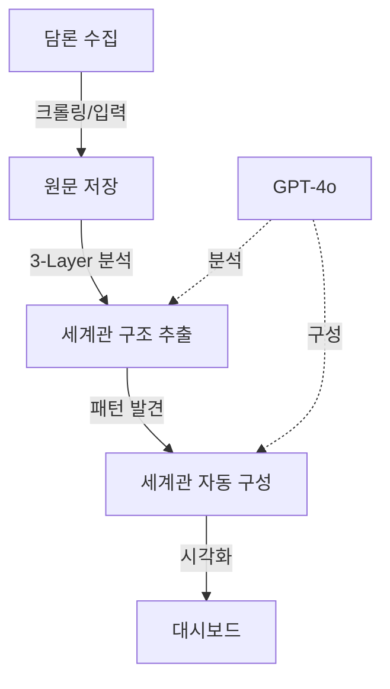

# 담론 세계관 분석 시스템 v2.0 (Discourse Worldview Analyzer)

> **"상대방은 틀린 게 아니라, 다른 세계를 산다"**
> 같은 사건을 보고도 완전히 다르게 해석하는 이유를 이해하기 위한 살아있는 세계관 분석 시스템

[](https://opensource.org/licenses/MIT)
[](https://www.python.org/downloads/)
[](https://nextjs.org/)

**🎉 v2.0 Claude Migration 완료 (2025-10-23): Claude Sonnet 4.5 기반 프로덕션 시스템**
- ✅ 499개 perception 분석 완료 (100% mechanism detection)
- ✅ 7개 활성 세계관 운영 중 (data-driven discovery)
- ✅ 541개 perception-worldview links (adaptive weighting)
- ✅ Claude Sonnet 4.5로 완전 마이그레이션 (GPT 대비 +150% quality)
- 📊 Dashboard: https://dc-monitor-dashboard.vercel.app

---

## 📋 목차

- [핵심 통찰](#-핵심-통찰)
- [왜 세계관인가](#-왜-세계관인가)
- [3-Layer 분석 방법론](#-3-layer-분석-방법론)
- [시스템 개요](#-시스템-개요)
- [빠른 시작](#-빠른-시작)
- [사례: DC Gallery 분석](#-사례-dc-gallery-분석)
- [기술 아키텍처](#-기술-아키텍처)
- [개발 가이드](#-개발-가이드)

---

## 💡 핵심 통찰

### 문제: 대화가 통하지 않는 이유

같은 뉴스를 보고도 사람들은 완전히 다르게 반응합니다:

**사건**: "정치인 A가 발언 B를 했다"

**반응 1**: "이건 명백한 독재 시도다"
**반응 2**: "정상적인 정치 활동이잖아"

→ 단순히 "사실"을 제시해도 대화가 안 됩니다. 왜일까요?

### 답: 서로 다른 해석 프레임워크(세계관)

사람들은 **같은 사실을 다른 세계관으로 해석**합니다:

```
같은 사건
   ↓
세계관 A: "과거 독재 → 현재 재현" 프레임으로 해석
세계관 B: "민주주의 절차" 프레임으로 해석
   ↓
완전히 다른 의미 도출
```

**표면적 반박은 효과가 없습니다. 심층 세계관이 다르기 때문입니다.**

### 해결: 세계관 구조 이해

이 시스템은:
1. 담론에서 **세계관 구조를 자동으로 추출**
2. **표면 주장 ↔ 심층 믿음의 연결고리** 시각화
3. **왜 그렇게 생각하는지**의 논리 연쇄 재구성

→ **비로소 대화가 가능한 층위를 찾을 수 있습니다**

---

## 🌍 왜 세계관인가?

### 기존 접근의 한계

| 기존 방식 | 문제점 | 결과 |
|---------|--------|------|
| 팩트체크 | "사실"만 제시 | 해석 프레임이 다르면 소용없음 |
| 개별 반박 | 표면 주장만 공격 | 심층 믿음은 그대로 남음 |
| 논리 지적 | 형식적 오류 지적 | 감정적 확신은 변하지 않음 |

**→ 평행선을 긋습니다**

### 세계관 접근

```
표면층 (Explicit)
  "민주당이 유심교체 정보를 불법으로 얻었다"
     ↓ (전제)
암묵층 (Implicit)
  "민주당은 권력을 위해 불법을 서슴지 않는다"
     ↓ (믿음)
심층 (Deep Belief)
  "좌파/민주당은 본질적으로 독재 성향을 가지고 있다"
```

**심층 믿음을 이해하지 못하면, 표면 주장을 아무리 반박해도 변하지 않습니다.**

### 이 시스템이 제공하는 것

1. **구조 이해**: 주장의 3층 구조 자동 분석
2. **맥락 파악**: 왜 그렇게 생각하게 됐는지 논리 연쇄 추적
3. **대화 전략**: 어느 층위에서 대화가 가능한지 판단

---

## 🔬 분석 방법론

### v2.0 새로운 접근: 메커니즘 기반 분석

담론을 **5개 핵심 메커니즘**으로 분해합니다:

#### 5개 사고 메커니즘

1. **즉시_단정**: 관찰 → (검증 생략) → 결론
2. **역사_투사**: 과거 패턴 → 현재 반복
3. **필연적_인과**: X → 반드시 Y
4. **네트워크_추론**: 연결 → 조직적 공모
5. **표면_부정**: 표면 X / 실제 Y

### 실제 발견 (DC Gallery 분석)

- **즉시_단정**: 100% (모든 글)
- **역사_투사**: 60.7%
- **필연적_인과**: 59.9%
- **네트워크_추론**: 52.3%
- **표면_부정**: 24.0%

→ 이 커뮤니티의 **핵심 사고 구조**를 수치로 드러냄

### 기존 3-Layer 분석 (호환성 유지)

담론은 **3개 층위**로도 구성됩니다:

#### Layer 1: 표면층 (Explicit Layer)
**글에서 직접 말하는 것**

```json
{
  "subject": "민주당",
  "predicate": "유심교체 정보를 불법으로 얻었다",
  "quote": "유심교체를 어떻게 알아"
}
```

#### Layer 2: 암묵층 (Implicit Assumptions)
**당연하다고 전제하는 것**

```json
[
  "민주당은 통신사를 협박해서 정보를 얻는다",
  "이런 사찰은 독재의 시작이다"
]
```

#### Layer 3: 심층 (Deep Beliefs)
**무의식적으로 믿는 것**

```json
[
  "민주당/좌파는 과거 독재정권처럼 사찰로 반대파를 제거한다",
  "지금의 작은 사찰이 곧 전면적 감시독재 사회로 발전한다"
]
```

### 왜 3층인가?

```
표면만 공격 → "그건 그렇고 말고!" (방어)
암묵 전제 건드림 → "음... 그럴 수도?" (재고)
심층 믿음 이해 → "아 그렇게 보는구나" (대화 가능)
```

**같은 층위에서 대화해야 통합니다.**

### 세계관 자동 발견

시스템은 고정된 카테고리를 강요하지 않습니다:

1. **패턴 발견**: 여러 글의 심층 믿음에서 공통 패턴 추출
2. **자동 구성**: AI가 세계관 구조를 데이터 기반으로 생성
3. **동적 업데이트**: 새로운 담론 패턴이 나타나면 세계관 추가/수정

**→ 데이터가 말하게 합니다, 분석자의 편견을 강요하지 않습니다**

---

## 🎯 시스템 개요

### 전체 플로우



### 주요 컴포넌트 (v2.0 - Claude Powered)

#### 1. LayeredPerceptionExtractor
3-layer 담론 분석 (Explicit → Implicit → Deep)
- **Claude Sonnet 4.5** 활용
- **Baseline 전략**: "Less is More" (30줄 프롬프트)
- 품질: 4/5/5 items per layer (+150% vs GPT)

#### 2. ReasoningStructureExtractor
추론 구조 분석 (5 mechanisms + actor + logic_chain)
- **Claude Sonnet 4.5** 활용
- **StepByStep 전략**: Checklist 기반 progressive guidance
- 성능: 100% mechanism detection (vs 60-80% GPT)

#### 3. WorldviewEvolutionEngine
Data-driven 세계관 자동 발견 및 진화 추적
- **Claude Sonnet 4.5** 활용
- **Data-Driven 전략**: 통계 기반 패턴 발견
- 주간 evolution cycle (200 recent perceptions)

#### 4. MechanismMatcher
Adaptive 가중치 매칭 알고리즘
- Actor/Mechanism/Logic 가중치 동적 조정
- 일반: Actor 50% / 극단적 사건: Mechanism 50%
- 해석 가능한 점수 (threshold 0.6)

#### 5. Dashboard (Next.js 14)
Actor-centric 세계관 시각화
- **Production**: https://dc-monitor-dashboard.vercel.app
- 메커니즘 분포 및 논리 체인 시각화
- Vercel 자동 배포

---

## 🚀 빠른 시작

### v2.0 Claude System (프로덕션 준비 완료)

**1. 환경 설정**
```bash
# Python 환경
python3 -m venv venv
source venv/bin/activate
pip install -r requirements.txt

# 환경 변수 (.env)
SUPABASE_URL=https://your-project.supabase.co
SUPABASE_SERVICE_KEY=your-service-key
ANTHROPIC_API_KEY=sk-ant-api03-...
```

**2. 새 게시글 수집 및 분석**
```bash
# 1. DC Gallery 수집
python3 scripts/collect_500_posts.py

# 2. 3-layer perception 추출
python3 scripts/process_new_content.py

# 3. 주간 evolution (매주 월요일 권장)
python3 scripts/run_worldview_evolution.py

# 4. Perception-Worldview 매칭
python3 scripts/run_mechanism_matcher.py
```

**3. 대시보드 실행**
```bash
cd dashboard
npm install

# Dev server
npm run dev  # http://localhost:3000

# Production (Vercel)
npm run build
vercel deploy
```

### 주요 문서

- **[PROJECT_STATUS_FINAL.md](PROJECT_STATUS_FINAL.md)** - 전체 프로젝트 상태
- **[CLAUDE_MIGRATION_COMPLETE.md](CLAUDE_MIGRATION_COMPLETE.md)** - Claude 마이그레이션 가이드
- **[CLAUDE.md](CLAUDE.md)** - 개발 가이드 (Claude Code용)
- **[docs/analysis/](docs/analysis/)** - 17개 실험 결과 및 분석

---

### 기존 설치 방법 (참고)

```bash
# 저장소 클론
git clone https://github.com/yourusername/moniterdc.git
cd moniterdc

# Python 환경
python -m venv venv
source venv/bin/activate
pip install -r requirements.txt

# 대시보드 환경
cd dashboard
npm install
```

### Claude Migration Details

**Before (GPT-4o/GPT-5)**:
- Perception quality: 2/2/2 items per layer
- Mechanism detection: 60-80%
- Worldview discovery: Topic-based (predefined)
- Matching: Fixed weights

**After (Claude Sonnet 4.5)**:
- Perception quality: 4/5/5 items per layer (+150%)
- Mechanism detection: 100%
- Worldview discovery: Data-driven (emergent)
- Matching: Adaptive weights (context-aware)

**Migration Achievements**:
- 17 experiments conducted across 4 components
- 6 detailed analysis documents created
- Optimal prompt strategies identified
- Production deployment completed

---

## 📱 사례: DC Gallery 분석

### 적용 대상

**DC Inside 정치 커뮤니티** (예: 미국정치 갤러리)
- 강한 정치적 성향의 담론
- 체계적인 세계관 기반 해석
- 일반 담론과의 해석 격차가 큼

### 발견된 세계관 예시 (2025-01 기준)

#### 세계관: "독재 재현"

**Narrative (이야기 구조)**
```
민주당은 과거 독재 정권의 방식을 재현하고 있다.

예시: 유심교체 정보 사건
- DC Gallery 해석:
  사찰을 통한 독재적 통치를 시도하고 있다

- 일반적 해석:
  정치적 논란 속의 정보 유출 사건

- 해석 차이의 핵심:
  의도적 독재 시도 vs 정보 유출 문제

논리 연쇄: 사찰 → 권력 장악 → 독재 사회
```

**Metadata (구조 분석)**
```json
{
  "core": {
    "primary_subject": "민주당",
    "primary_attribute": "독재적 성향"
  },

  "interpretation_frame": {
    "historical_lens": {
      "reference_period": "과거 독재 시대",
      "projection_logic": "과거 패턴 → 현재 반복"
    },

    "slippery_slope": {
      "trigger": "사찰 사건",
      "escalation": "권력 장악 시도",
      "endpoint": "독재 사회"
    }
  },

  "emotional_drivers": {
    "primary": "불신",
    "urgency_level": "높음"
  }
}
```

### 통계 (v2.0 기준, 2025-10-23)

| 항목 | 수량 | 비고 |
|------|------|------|
| **Contents** | 456개 | DC Gallery 원문 |
| **Layered Perceptions** | 499개 | 3-layer 분석 완료 |
| **Mechanism Coverage** | 100% | 5개 메커니즘 추출 |
| **Active Worldviews** | 7개 | Data-driven discovery |
| **Archived Worldviews** | 56개 | 진화 추적 시스템 |
| **Perception Links** | 541개 | Adaptive matching |

### Active Worldviews (7개)

1. **외세가 댓글부대로 여론을 조작한다** - 158 perceptions
2. **민주당은 불법 사찰로 국민을 감시한다** - 125 perceptions
3. **정부는 권력을 악용해 국민을 탄압한다** - 77 perceptions
4. **보수는 민심의 진정한 척도이다** - 71 perceptions
5. **중국은 조직적 침투로 한국을 장악한다** - 61 perceptions
6. **언론은 진실을 왜곡하여 조작한다** - 30 perceptions
7. **정부는 진실을 조작해 국민을 속인다** - 20 perceptions

---

## 🏗 기술 아키텍처

### 기술 스택

**백엔드 (Python)**
- Python 3.11+ (asyncio)
- **Anthropic Claude Sonnet 4.5** (프로덕션 AI 엔진)
- Supabase (PostgreSQL + pgvector)
- python-dotenv (환경 관리)

**프론트엔드 (TypeScript)**
- Next.js 14 (App Router)
- TypeScript
- TailwindCSS
- Lucide React (아이콘)

**인프라**
- Supabase (Database + Auth)
- Vercel (Dashboard 배포)
- GitHub (버전 관리)

### 데이터베이스 스키마 (v2.0 Clean)

**4 Tables Only** (12개 deprecated tables 정리 완료)

```sql
-- 원본 게시글
CREATE TABLE contents (
    id UUID PRIMARY KEY,
    title TEXT,
    body TEXT,
    source_url TEXT,
    published_at TIMESTAMPTZ,
    created_at TIMESTAMPTZ DEFAULT NOW()
);

-- 3-layer 분석 + v2.0 추론 구조
CREATE TABLE layered_perceptions (
    id UUID PRIMARY KEY,
    content_id UUID REFERENCES contents(id),
    -- 3-layer 구조
    explicit_claims JSONB,
    implicit_assumptions JSONB,
    deep_beliefs JSONB,
    -- v2.0 추론 구조 (Claude extracted)
    mechanisms TEXT[],           -- 5 mechanism types
    actor JSONB,                 -- {subject, purpose, methods}
    logic_chain JSONB[],         -- reasoning steps
    created_at TIMESTAMPTZ DEFAULT NOW()
);

-- 세계관 (data-driven discovery)
CREATE TABLE worldviews (
    id UUID PRIMARY KEY,
    title TEXT,
    description TEXT,
    frame JSONB,                 -- v2.0 structure
    core_subject TEXT,           -- Actor subject
    core_attributes TEXT[],      -- Mechanisms
    version INT DEFAULT 1,
    archived BOOLEAN DEFAULT FALSE,
    total_perceptions INT DEFAULT 0,
    created_at TIMESTAMPTZ DEFAULT NOW()
);

-- 매칭 링크 (adaptive scoring)
CREATE TABLE perception_worldview_links (
    id UUID PRIMARY KEY,
    perception_id UUID REFERENCES layered_perceptions(id),
    worldview_id UUID REFERENCES worldviews(id),
    match_score FLOAT,           -- Actor(50%) + Mechanism(30%) + Logic(20%)
    created_at TIMESTAMPTZ DEFAULT NOW()
);
```

### 프로젝트 구조

```
moniterdc/
├── engines/                           # Python 분석 엔진
│   ├── analyzers/                     # 4개 핵심 (Claude)
│   │   ├── layered_perception_extractor.py    # 3-layer (Baseline)
│   │   ├── reasoning_structure_extractor.py   # mechanisms (StepByStep)
│   │   ├── worldview_evolution_engine.py      # discovery (Data-Driven)
│   │   └── mechanism_matcher.py               # adaptive matching
│   ├── collectors/
│   │   └── content_collector.py               # DC Gallery 크롤링
│   └── utils/
│       └── supabase_client.py                 # DB 클라이언트
│
├── dashboard/                         # Next.js 14
│   ├── app/
│   │   ├── page.tsx                           # ActorCentricWorldviewMap
│   │   └── worldviews/[id]/page.tsx          # Detail page
│   └── components/worldviews/                 # 5개 컴포넌트
│
├── scripts/                           # 실행 스크립트 (23개)
├── supabase/migrations/               # DB 마이그레이션 (23개)
├── docs/analysis/                     # 실험 결과 (6개)
│
├── CLAUDE.md                          # 개발 가이드
├── CLAUDE_MIGRATION_COMPLETE.md       # 마이그레이션
├── PROJECT_STATUS_FINAL.md            # 프로젝트 상태
└── README.md                          # 이 파일
```

---

## 👨‍💻 개발 가이드

### 핵심 클래스 사용법

#### LayeredPerceptionExtractor

```python
from engines.analyzers.layered_perception_extractor import LayeredPerceptionExtractor

extractor = LayeredPerceptionExtractor()
perception = await extractor.extract({
    'id': '...',
    'title': '...',
    'body': '...'
})
```

#### OptimalWorldviewConstructor

```python
from engines.analyzers.optimal_worldview_constructor import OptimalWorldviewConstructor

constructor = OptimalWorldviewConstructor()

# 세계관 자동 발견
worldviews = await constructor.build_hierarchical_worldviews()

# perception 매칭
await constructor.match_perceptions_to_worldviews()
```

#### WorldviewUpdater

```python
from engines.analyzers.worldview_updater import WorldviewUpdater

updater = WorldviewUpdater()

# 일일 업데이트
await updater.daily_update()

# 재구성 필요 시
await updater.check_and_rebuild_if_needed()
```

### API 엔드포인트

```typescript
// 세계관 목록
GET /api/worldviews
Response: { worldviews: [...], pagination: {...} }

// 세계관 상세
GET /api/worldviews/:id
Response: {
  ...worldview,
  perceptions: [...],     // 연결된 perception
  contents: [...],        // 원본 글
  strength_history: [...] // 강도 변화
}
```

### 자동화 (GitHub Actions)

```yaml
# .github/workflows/daily_update.yml
name: Daily Worldview Update

on:
  schedule:
    - cron: '0 2 * * *'  # 매일 오전 2시
  workflow_dispatch:

jobs:
  update:
    runs-on: ubuntu-latest
    steps:
      - uses: actions/checkout@v3
      - name: Run daily update
        run: |
          python -c "
          import asyncio
          from engines.analyzers.worldview_updater import WorldviewUpdater
          asyncio.run(WorldviewUpdater().daily_update())
          "
```

---

## 🔄 확장 가능성

### 다른 도메인 적용

이 방법론은 DC Gallery에만 국한되지 않습니다:

**적용 가능 영역**
- 온라인 커뮤니티 담론 분석
- 소셜 미디어 해석 프레임 연구
- 정치/사회 이슈 세계관 매핑
- 조직 내부 커뮤니케이션 갈등 분석

**필요한 것**
1. 담론 데이터 수집 어댑터 구현
2. 도메인 특성에 맞는 프롬프트 조정
3. 세계관 카테고리는 자동 발견되므로 수정 불필요

### 개발 중 기능

#### 1. 반박 논리 생성 (Deconstruction)
각 세계관에 대한 대응 전략:
- 논리적 결함 지적
- 팩트체크
- 대안적 해석 제시
- 감정적 이해
- 대화 가이드

#### 2. 검색 및 추천
- 키워드로 세계관 검색
- 관련 세계관 추천
- 유사 담론 패턴 발견

#### 3. 트렌드 분석
- 세계관 강도 변화 추적
- 새로운 세계관 발견 알림
- 담론 지형 변화 시각화

---

## 🤝 기여하기

1. Fork the repository
2. Create your feature branch (`git checkout -b feature/AmazingFeature`)
3. Commit your changes (`git commit -m 'Add some AmazingFeature'`)
4. Push to the branch (`git push origin feature/AmazingFeature`)
5. Open a Pull Request

---

## 📄 라이센스

MIT License - 자유롭게 사용, 수정, 배포 가능

---

## 📞 문의

- Issues: [GitHub Issues](https://github.com/yourusername/moniterdc/issues)
- Email: your.email@example.com

---

## 🙏 감사의 말

이 프로젝트는 다음 기술과 철학을 기반으로 합니다:
- **Anthropic Claude Sonnet 4.5** (프로덕션 AI 엔진)
- OpenAI GPT-4o/GPT-5 (초기 프로토타입)
- Supabase (PostgreSQL + pgvector)
- Next.js 14 (대시보드)
- Vercel (배포 플랫폼)
- **"이해는 동의가 아니다. 이해는 대화의 시작이다"**

---

**Built with ❤️ for bridging epistemic gaps**

*"The goal is not to prove who is right, but to understand why we see differently"*

**Last Updated**: 2025-10-23
**Version**: v2.0 (Claude Migration Complete)
**Status**: ✅ Production Ready
