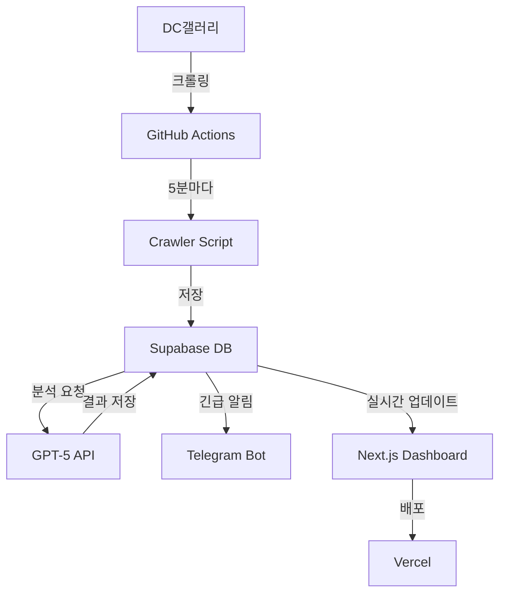

# 🎯 DC갤러리 정치 AI 모니터링 시스템

> 정치 여론의 골든타임을 놓치지 않는 24시간 AI 감시 시스템

## 📌 프로젝트 개요

DC갤러리의 정치 관련 게시글을 실시간으로 수집하고, AI(GPT-5)를 활용해 중요도를 분석하며, 긴급 이슈를 즉시 알려주는 통합 모니터링 시스템입니다.

### 핵심 기능
- ⚡ **실시간 크롤링**: 5분 간격 자동 수집
- 🤖 **AI 분석**: GPT-5 시리즈를 활용한 3단계 분석
- 📱 **즉각 알림**: Telegram Bot을 통한 실시간 알림
- 📊 **대시보드**: 실시간 모니터링 및 데이터 시각화
- 💰 **무료 운영**: Supabase + Vercel 무료 티어 활용

## 🛠 기술 스택

### 인프라 (완전 무료)
- **Database**: Supabase (PostgreSQL + Realtime)
- **Backend**: Vercel Serverless Functions
- **Frontend**: Next.js + Vercel
- **Scheduler**: GitHub Actions (5분 간격)

### AI & 분석
- **GPT-5 nano**: 1차 필터링 (초고속, 저비용)
- **GPT-5 mini**: 2차 상세 분석
- **GPT-5**: 전략 수립 (긴급 이슈만)

### 알림 & 모니터링
- **Telegram Bot**: 실시간 알림
- **Supabase Realtime**: WebSocket 기반 실시간 업데이트

## 📁 프로젝트 구조

```
moniterdc/
├── .github/
│   └── workflows/       # GitHub Actions 크롤링 스케줄러
├── crawler/            # DC갤러리 크롤러
│   ├── main.py        # 메인 크롤링 로직
│   └── requirements.txt
├── supabase/          # 데이터베이스
│   ├── migrations/    # 스키마 마이그레이션
│   └── functions/     # Edge Functions
├── dashboard/         # Next.js 대시보드
│   ├── pages/
│   ├── components/
│   └── package.json
├── telegram-bot/      # 텔레그램 봇
│   └── bot.py
├── docs/             # 문서
└── .env.example      # 환경변수 템플릿
```

## 🚀 Quick Start

### 1. 환경 설정
```bash
# 저장소 클론
git clone https://github.com/yourusername/moniterdc.git
cd moniterdc

# 환경변수 설정
cp .env.example .env
# .env 파일에 필요한 API 키 입력
```

### 2. Supabase 설정
```bash
# Supabase CLI 설치
npm install -g supabase

# 프로젝트 초기화
supabase init

# 마이그레이션 실행
supabase db push
```

### 3. 대시보드 실행
```bash
cd dashboard
npm install
npm run dev
```

## 📊 시스템 아키텍처



## 📈 성과 지표

- ✅ **이슈 감지 시간**: 5분 이내
- ✅ **AI 분석 정확도**: 90% 이상
- ✅ **시스템 가동률**: 99% 이상
- ✅ **일일 운영 비용**: $5 이하
- ✅ **알림 전송 지연**: 10초 이내

## 🔐 보안

- 모든 API 키는 환경변수로 관리
- Supabase RLS(Row Level Security) 적용
- Rate Limiting 적용
- 개인정보 자동 마스킹

## 📝 라이선스

MIT License

## 👥 기여하기

이슈와 PR은 언제나 환영합니다!

## 📞 문의

질문이나 제안사항이 있으시면 이슈를 생성해주세요.

---

Built with ❤️ for Political Intelligence
